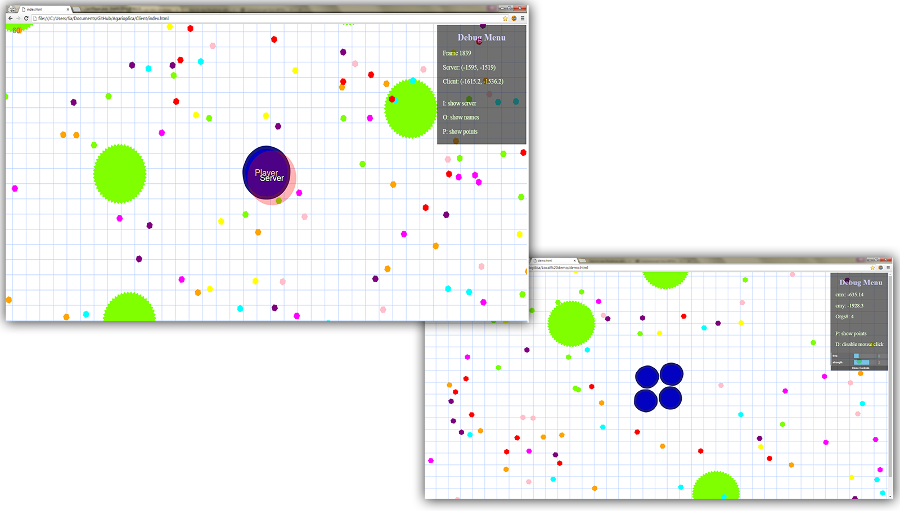

# Agarioplica

A replica of the real-time multiplayer game [agar.io](http://agar.io/), features client-side prediction and lag compensation

The server is in Java. Client code utilizes HTML5 and Jquery.
Server-Client communication is done using [web sockets](https://developer.mozilla.org/en-US/docs/Web/API/WebSockets_API)

##### STILL A WORK IN PROGRESS!!

#### Gameplay
Move with mouse, Shoot mass with a left-click.

#### Demo
There's a simple browser-only demo in the [Local demo](https://github.com/sam46/Agar.io-Clone/tree/master/Local%20demo) folder. Check it out to quickly see if you dig it. 
Use google chrome!!

#### Building

To run the server, build the files in the src folder, and include the jar file in your project dependencies. Run the client from the Client folder (Use google chrome). 

#### TODO List
- [x] Fixing time-stepping on server and clients
- [ ] Handling blob generation and synchronization across clients
- [ ] Collision Detection (with Quad trees?)
- [x] Porting physics to Java on the server 
- [ ] Implementing [Source strategy](https://developer.valvesoftware.com/wiki/Source_Multiplayer_Networking) for client-server  communication. Better explained [here](http://www.gabrielgambetta.com/fpm1.html) (In progress)
- [ ] Replacing string data communication between server and clients with other formats/encoding. ( JSON or raw binary? ) 
- [x] Enhanced graphics/effects  (added blobbiness/elasticity effects)
- [ ] Tweaking input processing and buffering across threads
- [ ] Optimization for cpu-heavy code
- [ ] Creating a pre-game panel for preliminary settings and player name input
- [ ] testing java mulithreading for potential concurrency flaws
- [ ] Splitting upon colliding into viruses (In progress)

This project uses a websockets Java library by TooTallNate:
https://github.com/TooTallNate/Java-WebSocket/blob/master/dist/java_websocket.jar

Created in Summer 2016.
